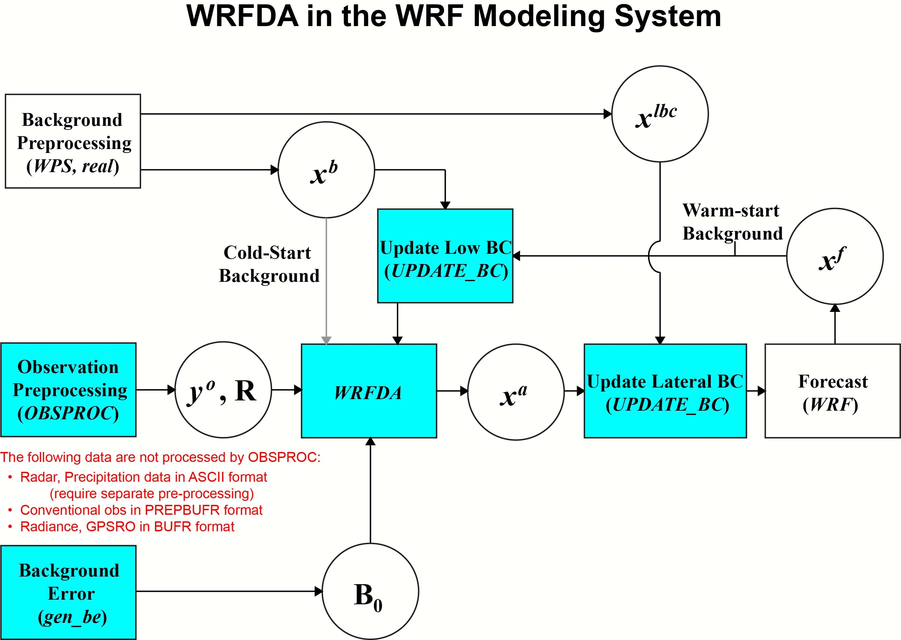

变分数据同化系统的基本目标是对分析时的真实大气状态生成最佳的估计，通过对指定成本函数进行迭代求解（Ide et al., 1997）：

The basic goal of any variational data assimilation system is to produce an optimal estimate of the true atmospheric state at analysis time through iterative solution of a prescribed costfunction (Ide et al., 1997):

$$
J(x) = J_b(x) + J_o(x) = \frac{1}{2}(x-x^b)^T B^{-1}(x-x^b) + \frac{1}{2}(y-y^o)^T(E + F)^{-1}(y - y^o). \tag{11.1}
$$

变分问题可以概括为 $(11.1)$ 的迭代最小化，以找到使 $J(x)$ 最小的分析状态 $x$ 。
该解决方案代表先验数据的两个来源：第一次估计（或背景场）$x^b$ 和观测值 $y^o$ （Lorenc，1986），给出了大气真实状态的后验最大似然（最小方差）估计。
各个数据点的拟合度通过估计其误差来加权：$B$，$E$ 和 $F$ 分别是背景，观测值（仪器）和代表性误差协方差矩阵。
代表性误差是通过观测算子 $H$ 引入的不准确度的估计值，$H$ 用于将网格化分析 $x$ 转换为观测空间 $y=H(x)$ 以与观测值进行比较。
该误差将取决于分辨率，并且还可能包括 $H$ 中的近似值（例如线性化）的影响。
如 Barker 等所述（2004年）。WRFDA 中采用的特定变分数据同化算法是变分问题的模型空间增量公式。
在这种方法中，将观察值，先前的预测，其误差和物理定律组合在一起，以产生分析增量 $x^{a'}$，将其添加到第一次估计值 $x^b$ 中以提供更新的分析。

图 11.1：显示了 ARW 系统的数据集（圆形）和算法（矩形）之间的关系。

WRFDA 的三个输入是：

a）第一次估计 $x^b$ —— 在冷启动模式下，这通常是通过 WPS 和 ARW *real* 程序插值到 ARW 网格（和变量）的另一个模型的预测/分析。
在循环模式下，第一次估计是短距离（通常为1到6个小时）ARW预测。

b）观测值 $y^o$ —— 在当前版本的 WRFDA 中，观测值可能以 PREPBUFR 格式（*ob_format=1*）或 ASCII “little_r” 格式（*ob_format=2*）提供。
随代码发布提供了一个观察预处理器（OBSPROC），以执行基本的质量控制，分配“总计”观察误差（图11.1中的 $R=E+F$），并将 MM5 *little_r* 文本格式的观察重新格式为 WRFDA 自己的文本格式。
可以在 Barker 等人（2003，2004）的文章中找到详细信息。

c）背景误差协方差 $B$ —— 用于定义分析对观测值的空间和多元响应。
在变分系统中，这些协方差通常是离线计算的，需要进行重大调整才能优化特定应用程序的性能 (e.g., Ingleby (2001); Wu et al. (2002))。
令人满意地完成这项工作所需的工作量是巨大的，不应低估。
为了帮助用户，WRFDA 开发人员提供了以下内容：

- i）用于域的初始设置的一组默认统计信息；
- ii）实用程序 *gen_be*（在第11.3节中描述），将预测的集合处理到适当的控制变量空间中；
- iii）诊断程序，以评估观察结果和背景误差统计的准确性。
这些例程既包括基于创新矢量的方法（Hollingsworth 和 Lonnberg，1986），也包括变分调整方法（Desroziers和Ivanov，2001）。

对所有数据进行同化后，将产生一个分析 $x^a$，该分析 $x^a$ 必须与 *UPDATE_BC* 实用程序中的现有横向边界条件 $x^{lbc}$ 合并 (Barker et al. (2003))。
在此阶段，将更新 WPS/real 的 *wrfbdy* 横向边界条件文件 ($x^{lbc}$) 输出，以使横向边界与分析一致，并且表面场（例如 SST）也将在 *wrfinput* 分析文件中更新。
