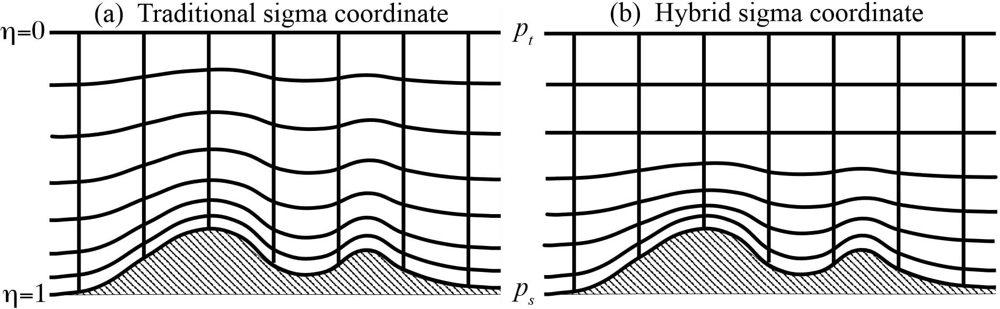

ARW 使用 $\eta$ 表示跟随地形的静力垂直坐标，该坐标也称为质量垂直坐标。在之前的 ARW 版本中，$\eta$ 被定义为

$$ \eta=\frac{p_d-p_t}{p_s-p_t} \tag{2.1} $$

式中 $p_d$ 为干空气压力的静力分量，而 $p_s$ 和 $p_t$ 分别指沿着地表和顶部边界的 $p_d$ 值。Laprise(1992) 提出的与非静力方程一起使用的坐标定义 (2.1) 是许多静水大气模型中使用的传统 sigma 坐标。$\eta$ 的变化范围为从地表的 1 到模型上边界的 0 （图 2.1a)。

Figure 2.1: ARW η coordinate.

在 ARW 第 4 版中，垂直坐标得到了推广，以使地形对坐标表面的影响随着表面上方高度的增加而更快地消除，如图 2.1b 所示。对此修改后的垂直坐标，我们采用了 Park(2013) 等人 (2013) 的混合 sigma-pressure 垂直坐标，类似于 NCAR CAM3.0 技术说明中所述的国家大气研究中心 (NCAR) 社区大气模型 (CAM) 中使用的方法：

$$ p_d=B(\eta)(p_s-p_t)+[\eta-B(\eta)](p_0-p_t)+p_t \tag{2.2} $$

其中 $p_0$ 是参考海平面压力。（此坐标表示法与 CAM 有所不同，它基于干压而不是全压，并使用 $p_t$ 进行归一化，使得在 $p_d=p_t$ 时 $\eta$=0)。这里，$B(\eta)$ 定义地形跟随 sigma 坐标和纯压力坐标之间的相对权重，使得当 $B(\eta)=\eta$ 时 $\eta$ 对应于 sigma 坐标 (2.1) 而 $B(\eta)=0$ 时对应于静力坐标。从地表附近的 sigma 坐标到高层的压力坐标，$B(\eta)$ 由三阶多项式定义

$$ B(\eta)=c_1+c_2\eta+c_3\eta^2+c_4\eta^3 \tag{2.3} $$

（其中下标 $\eta$ 表示微分） 受边界条件的约束

$$ B(1)=1, B_{\eta}(1)=1, B(\eta_c)=0, B_{\eta}(\eta_c)=0 \tag{2,4} $$

同时

$$ c_1=\frac{2\eta^2_c}{(1-\eta_c)^3}, c_2=\frac{-\eta_c(4+\eta_c+\eta^2_c)}{(1-\eta_c)^3}, c_3=\frac{2(1+\eta_c+\eta^2_c)}{(1-\eta_c)^3}, c_4=\frac{-(1+\eta_c)}{(1-\eta_c)^3} \tag{2.5} $$

其中 $\eta_c$ 是 $\eta$ 的特定值，在该处转变为纯压力坐标。

图 2.2 显示了传统 sigma 坐标和混合坐标的 $B(\eta)$ 分布，其中包含参数 $\eta_c$ 的多个值。作为 $\eta$ 的函数图 （图 2.2a)，图 2.2a 描绘了在 (2.3) 中定义的多项式的形式。然而，将 $B(\eta)$ 作为高度的函数绘制 （图 2.2b) 可提供更好的物理感受，即随着高度的增加向 $p$ 坐标的过渡。例如，对于深度为 30 km 的模型域，对于 $\eta_c=0.2$ ，垂直坐标约在 12 km 的高度处变为纯压力坐标。

垂直坐标指标定义为

$$ \mu_d=\frac{{\partial}p_d}{{\partial}\eta}=B_\eta(p_s-p_t)+[1-B_\eta(\eta)](p_0-p_t) \tag{2.6} $$

由于 $\mu_d\triangle\eta={\triangle}p_d=-g\rho_d{\triangle}z$ 与网格单元中单位面积的质量成正比，因此将预报变量的恰当的通量形式定义为

$$ \mathbf{V} = {\mu_d}\mathbf{v}=(U,V,W), \Omega=\mu_d\omega, \Theta=\mu_d\theta_m, Q_m={\mu_d}q_m \tag{2.7} $$

这里，$\mathbf{v}=(u,v,w)$ 是水平和垂直方向的协变速度，而 $\omega=\dot{\eta}$ 是“垂直”逆变速度。  $\theta_m=\theta(1+(R_v/R_d)q_v)\approx\theta(1+1.61q_v)$ 是湿位温，$Q_m={\mu_d}q_m,$ 其中 $q_m=q_v,q_c,q_r\cdots$ 表示水汽变量的混合比（水蒸气，云水，雨水 $\cdots$ )。尽管在 ARW 的控制方程中，位势 $\phi=gz$ 也是一个预报变量，但由于 $\mu_d\phi$ 不是守恒量，因此不能以通量形式编写。

Figure 2.2.

图 2.2：对于 $\eta_c$ = 0., 0.1, 0.2, 0.3, 0.4, and 0.5 的 sigma ($\sigma$) 坐标系和混合坐标系的 $B(\eta)$ 表明了图 (a) 是 $\eta$ 的函数，而图 (b) 为高度的函数，在上边界高度为 30 km 的标准大气区域内。
